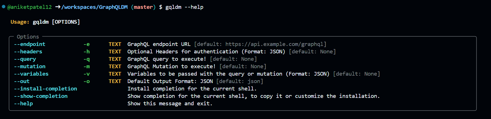

# GraphQLDM
GraphQLDM (GraphQL Data Manipulation) is a powerful command-line tool for seamless interaction with GraphQL APIs. It offers easy querying, mutation execution, and data manipulation, empowering developers to efficiently manage and explore GraphQL data through simple commands.

## Installation

You can install GraphQLDM using pip:

```bash
pip install graphqldm
```

## Setup

After installing, make sure to set the `PYTHONPATH` environment variable to include the path to your GraphQLDM package. You can do this by adding the following line to your shell configuration file(e.g, `.bashrc`, `.zshrc`):

```bash
export PYTHONPATH=/path/to/GraphQLDM:$PYTHONPATH
```

Replace `/path/to/GraphQLDM` with the actual path to your GraphQLDM package.

This ensures that Python can find the necessary modules and packages when running the gqldm command.

## Usage

After installing GraphQLDM and setting up your environment variables, you can use the `gqldm` command to interact with GraphQL APIs. Here are some examples of how to use it:

### Execute a GraphQL query:

```bash
gqldm --endpoint "https://example.com/graphql" --query "Your GraphQL Query Here" --headers '{"Authorization": "Bearer your_token"}' 
```

### Execute a GraphQL Mutation:

```bash
gqldm --endpoint "https://example.com/graphql" --mutation "Your GraphQL Mutation Here" --headers '{"Authorization": "Bearer your_token"}'
```

### Pass variables with the query or mutation :

```bash
gqldm --endpoint "https://example.com" --query "Your GraphQL Query Here" --headers '{"Authorization":"Bearer your_token"}' --variables '{"input": {"param1": "value1", "param2": "value2"}}''
```

### Specify output format (JSON or YAML):

```bash
gqldm --query "your_query_here" --out yaml
```

For more information on available options and usage, you can use the `--help` option:

```bash
gqldm --help
```
## Output:



### Contributing

If you want to contribute to GraphQLDM, feel free to open an issue or submit a pull request on GitHub.
